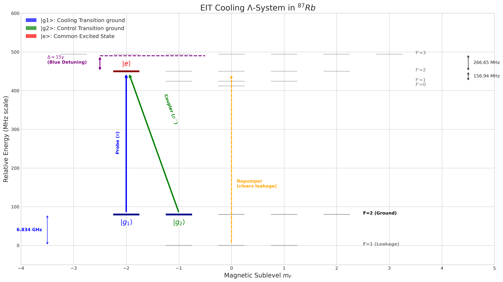
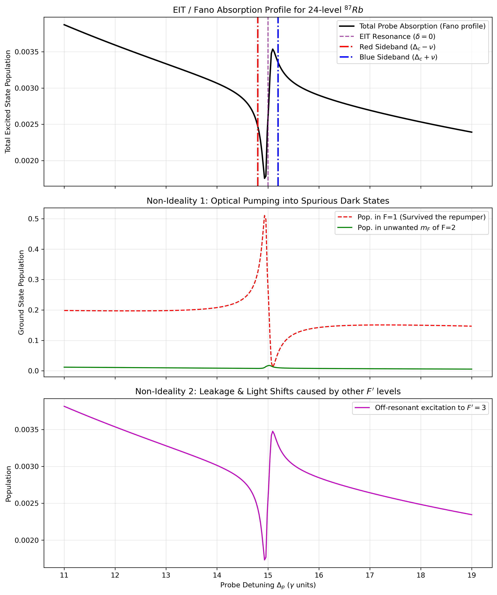

# EIT Cooling of a Trapped Atom

## Status: work in progess(something may be wrong)
---

## Overview

This project implements a numerical simulation of **Electromagnetically Induced Transparency (EIT) cooling** using the QuTiP library.  
The system models a **three-level atom in $\Lambda$ configuration coupled to a quantized vibrational mode** (harmonic trap).

---

## Physical Model

We consider:
- Two ground states: $|g_1\rangle, |g_2\rangle$
- One excited state: $|e\rangle$
- A quantized harmonic oscillator (vibrational motion of the trapped atom)

The goal of EIT cooling is to **suppress carrier excitation and enhance red-sideband transitions**, allowing the system to relax toward low vibrational states.

In this regime ($\Delta < 0$), the lasers are detuned to the blue of the atomic transition
(While `Delta_c` is numerically set to `-15.0` in the code, this represents a **physical blue detuning** ($\Delta > 0$) due to the Hamiltonian construction:
$$H_{int} = -\Delta_p |g_1\rangle\langle g_1| - \Delta_c |g_2\rangle\langle g_2| + \dots$$
The double negation ($- \Delta$ where $\Delta = -15$) effectively places the ground state energy below the laser frequency, ensuring the laser is tuned to the blue of the atomic resonance).

- **Dark State:** Interference prevents absorption at the carrier frequency ($\Delta_p = \Delta_c$)
- **Fano Resonance:** A narrow absorption peak is generated

We tune the **Stark shift**:
$$\delta = \frac{\Omega_c^2}{4\Delta_c}$$

so that this peak aligns with the **red sideband** ($\omega_{\text{trap}}$), removing phonons from the system until the ground state is reached.

---

## 📂 Project Structure

`Fano_profile.py` is a simple simulation of a Fano spectrum ignoring the harmonic oscillator.

The code inside the folder `EIT_cooling` is modularized to allow fast visualization without repeating calculations:

| File | Function |
| :--- | :--- |
| `config.py` | Contains all physical parameters ($\Omega, \Delta, \eta, \nu$) and simulation time-steps |
| `simulation.py` | Builds the Hamiltonian, solves the Master Equation (Lindblad), and saves results in `results/` |
| `plot.py` | Loads saved data and generates a 3-panel animation of the cooling process |
| `requirements.txt` | Dependencies: `numpy`, `scipy`, `matplotlib`, `qutip` |
| `results` | results |
| `plots` | plots |

---

## Workflow

### Step 1 — Define Physical Parameters

We define all relevant energy scales in units of the spontaneous emission rate $\gamma$:

- $\gamma$: spontaneous emission rate  
- $\nu$: trap frequency  
- $\Delta_c$: control laser detuning  
- $\Delta_p$: probe detuning  
- $\Omega_c$: control Rabi frequency  
- $\Omega_p$: probe Rabi frequency  
- $\eta$: Lamb-Dicke parameter  

The control field is tuned to satisfy the **EIT cooling condition (Stark-shift matching)**:
$$
\Omega_c \approx \sqrt{4|\Delta_c|\nu}
$$

#### Parameters Used

| Parameter | Symbol | Value |
| :--- | :--- | :--- |
| Trap Frequency | ν | 0.5 γ |
| Coupling Detuning | Δ_c | -15.0 γ |
| Lamb-Dicke Parameter | η | 0.35 |
| Max Phonons | N_vib | 25 |

---

### Step 2 — Initial State

The system starts in a product state:

- Atom in ground state $$|g_1\rangle$$
- Motion in a Fock state $$|n=15\rangle$$

$$
|\psi_0\rangle = |g_1\rangle \otimes |n=15\rangle
$$

This allows us to observe vibrational relaxation during cooling.

---

### Step 3 — Build the Hilbert Space

We construct the full space as:

$$
\mathcal{H} = \mathcal{H}_{atom} \otimes \mathcal{H}_{motion}
$$

Using QuTiP:
- Atomic operators: projectors and transitions between levels
- Motional operators: creation and annihilation operators

Key operators:
- $a, a^\dagger$: phonon ladder operators  
- $n = a^\dagger a$: phonon number operator  
- $\sigma_{e g_i}$: atomic transitions  

---

### Step 4 — Hamiltonian

The full Hamiltonian includes:

#### 1. Free energy terms
$$
H_0 = -\Delta_p |g_1\rangle\langle g_1| - \Delta_c |g_2\rangle\langle g_2| + \nu a^\dagger a
$$

#### 2. Laser interactions

- Control field couples $|g_2\rangle \leftrightarrow |e\rangle$
- Probe field couples $|g_1\rangle \leftrightarrow |e\rangle$ including motional coupling:

$$
H_{\text{int}} \propto \Omega_p \, \sigma_{e g_1}
\left(1 + i \eta (a + a^\dagger)\right) + \text{h.c.}
$$

This term introduces **sideband transitions**, which are essential for cooling.

---

### Step 5 — Dissipation

Spontaneous emission is included via collapse operators:

- $|e\rangle \rightarrow |g_1\rangle$
- $|e\rangle \rightarrow |g_2\rangle$

This introduces irreversibility and allows cooling.

---

### Step 6 — Solve Master Equation

We solve the Lindblad master equation:

$$
\frac{d\rho}{dt} = -i[H,\rho] + \sum_k \mathcal{D}[C_k]\rho
$$

Using:
```python
mesolve(H, psi0, t_list, c_ops, [n_op])
```

### Step 7 — EIT Spectrum

To characterize the cooling mechanism, we compute the **steady-state excitation spectrum** by scanning the probe detuning $\Delta_p$.

For each value of $\Delta_p$:

1. We construct the atomic Hamiltonian in the rotating frame  
2. We solve the steady-state master equation:
$$\frac{d\rho}{dt} = 0$$
3. We evaluate the excited-state population:
$$I(\Delta_p) = \langle e|\rho_{ss}|e\rangle$$

This spectrum reveals:
- The EIT dark state (transparency window)
- Suppression of carrier excitation
- Asymmetric sideband structure (Fano-like profile)

---

### Step 8 — Physical Observables

#### Vibrational dynamics

The expectation value of the phonon number is:
$$\langle n(t) \rangle$$

This is the main indicator of cooling efficiency, showing how the system approaches a low-energy steady state.

---

#### Quantum state evolution

The full density matrix $\rho(t)$ is stored at each timestep, allowing reconstruction of:
- Atomic populations  
- Vibrational populations  
- Atom–motion correlations  

---

#### EIT spectrum

The steady-state scan provides:
- Excitation probability vs detuning  
- Identification of dark-state suppression  
- Cooling-resonant red sideband enhancement  

---
## How to Run

### 1. Setup Environment

Install the required libraries:

```bash
pip install -r requirements.txt
```

### Execute Simulation
Run the numerical solver. This will generate data files in a new results/ folder:
```bash
python simulation.py
```

### Visualize Results
Run the plotting script to open the interactive animation:
```bash
python plotting.py
```

---

## Visualization Details

The animation generated by `plotting.py` in plots consists of:

- **Phonon Distribution (Left):**  
  A bar chart showing the population of Fock states $|n\rangle$ evolving from $n = 15$ towards $n = 0$.

- **EIT Spectrum (Center):**  
  The Fano profile showing the "dark" window at the carrier and the cooling peak at the Red Sideband.

- **Cooling Curve (Right):**  
  The expectation value of the phonon number $\langle n \rangle$ vs time.

---
<p align="center">
  
</p>


# 87Rb EIT Cooling Simulation: 24-Level Hyperfine Manifold
 Unlike simplified 3-level models, this simulation accounts for the full 24-level hyperfine structure to analyze optical pumping, leakage, and cooling efficiency.

## 1. Atomic Level Structure
The simulation models the $D_2$ transition ($5S_{1/2} \rightarrow 5P_{3/2}$) of $^{87}Rb$, comprising:
*   **Ground Manifold (8 states):** $F=1$ (3 states) and $F=2$ (5 states).
*   **Excited Manifold (16 states):** $F'=0, 1, 2, 3$ with their respective $m_F$ sublevels.

### The Cooling $\Lambda$-System
The EIT cooling is established between Zeeman sublevels of the $F=2$ manifold:
*   **$|g_1\rangle$ (Probe state):** $|F=2, m_F=-2\rangle$
*   **$|g_2\rangle$ (Coupler state):** $|F=2, m_F=-1\rangle$
*   **$|e\rangle$ (Excited state):** $|F'=2, m_F=-2\rangle$

To prevent atoms from becoming trapped in the $F=1$ manifold due to spontaneous decay, a **Repumper laser** is included, driving the $F=1 \rightarrow F'=2$ transition.

## 2. Physics: EIT and the Fano Profile
In a standard 2-level system, absorption follows a symmetric Lorentzian profile. In this 3-level $\Lambda$ configuration:

*   **EIT Resonance:** Destructive quantum interference between the probe and coupler transition paths creates a "dark state," leading to a narrow dip in absorption where the atom becomes transparent.
*   **Fano Profile:** Because the lasers are **Blue Detuned** ($\Delta \approx 15\gamma$ above resonance), the narrow EIT resonance interferes with the broad background of the atomic transition. This produces an asymmetric **Fano Profile**.
*   **Cooling Mechanism:** The steep slope of the Fano resonance is utilized for sideband cooling. By matching the trap frequency $\nu$ to the EIT feature, the atom preferentially scatters photons that remove motional energy (the **Red Sideband**).

## 3. Computational Methodology
The simulation utilizes the **Lindblad Master Equation** to find the steady-state density matrix $\rho_{ss}$ of the 24-level system:

$$\dot{\rho} = -\frac{i}{\hbar} [H, \rho] + \sum_i \mathcal{L}_i(\rho)$$

### Hamiltonian ($H$)
The Hamiltonian is constructed in the 24-level Hilbert space:
1.  **Atomic Term:** Includes the physical hyperfine energy splits for $F'=0, 1, 2, 3$.
2.  **Interaction Term:** Laser couplings are defined using the Rabi frequency $\Omega$ and **Clebsch-Gordan coefficients** calculated for specific polarizations ($\sigma^-$, $\pi$):
    $$V = \frac{\Omega}{2} \sum_{g,e} C_{g,e} |e\rangle\langle g| + \text{h.c.}$$

### Dissipation ($\mathcal{L}$)
Spontaneous emission is modeled using collapse operators that account for all 48 possible decay paths from the 16 excited states back to the 8 ground states, weighted by their respective transition strengths.

### Numerical Implementation
The simulation is implemented in Python using the `QuTiP` library:
*   `steadystate(H, c_ops)` is used to solve for $\rho_{ss}$ at each probe detuning.
*   The **Absorption Spectrum** is extracted as the expectation value of the total excited state population: $A = \text{Tr}(\rho_{ss} \sum |e_i\rangle\langle e_i|)$.

## 4. Diagnostic Outputs
The simulation generates three primary plots:
1.  **Total Absorption:** Visualizes the Fano profile and identifies the EIT resonance.
2.  **Ground State Populations:** Monitors "leakage" into the $F=1$ manifold and optical pumping into non-target $m_F$ states.
3.  **Off-resonant Leakage:** Analyzes the influence of the $F'=3$ manifold, which causes light shifts and impacts the EIT transparency.

# WARNING: STILL WORKING ON IT!!!! THE FANO PROFILE IS NOW WRONG



