# EIT Cooling of a Trapped Atom

## Status
Work in progress (models under refinement — results may contain inaccuracies)

---

## Overview

This project implements numerical simulations of **Electromagnetically Induced Transparency (EIT) cooling** using QuTiP, at two different levels of complexity:

- **3-level Λ system** (idealized model)
- **24-level $^{87}$ Rb system** (realistic hyperfine + Zeeman structure)

The goal is to study how quantum interference enables cooling of a trapped atom to its motional ground state, and how real atomic complexity affects performance.
This model is one-dimensional (currently working on the 3D implementation), the final goal is to study EIT inside an hollow core photonic crystal fiber.

---

## Theory

For a rigorous mathematical derivation of the physics behind this simulation, you should refer to the seminal works on EIT cooling, such as Morigi et al. (2000, "Ground State Laser Cooling Using Electromagnetically Induced Transparency").

### Introduction: The Resolved Sideband Limit and the EIT Advantage

When an atom is confined within a harmonic potential, its center-of-mass motion is quantized into discrete vibrational states separated by the trap frequency, $\nu$. This quantized motion phase-modulates the atom's interaction with an incident optical field, generating motional sidebands in the absorption spectrum. These sidebands appear at frequencies detuned from the primary atomic resonance (the carrier) by integer multiples of $\nu$. Specifically, driving the "red" sideband corresponds to the extraction of a vibrational quantum (cooling), while driving the "blue" sideband adds a quantum (heating).


Ground-state cooling of trapped particles is conventionally achieved via Resolved Sideband Cooling (RSC). This technique relies on the selective excitation of the red motional sideband to extract vibrational quanta. However, RSC strictly requires the system to operate within the resolved sideband regime, where the harmonic trap frequency $\nu$ significantly exceeds the natural linewidth $\gamma$ of the cooling transition ($\nu \gg \gamma$). 

While this condition is readily satisfied for trapped ions, whose strong Coulomb confinement yields trap frequencies in the MHz range, it is violated for neutral atoms. Due to the comparatively weak confinement provided by optical dipole traps or optical lattices, the trap frequencies for neutral atoms are typically much lower than the natural atomic linewidth ($\nu \ll \gamma$). Consequently, the motional sidebands remain unresolved and obscured by the broad atomic resonance profile, rendering standard RSC ineffective.


Electromagnetically Induced Transparency (EIT) cooling circumvents this limitation through optical engineering of the atomic absorption spectrum. By coupling a $\Lambda$-type three-level system with two distinct optical fields (a strong **coupling** laser and a weak **probe** laser), quantum interference between the excitation pathways is induced. This interference generates a Fano-like absorption profile characterized by a completely dark state and an artificially narrow resonance. 

By tuning the laser parameters, the carrier transition is aligned with the dark state, suppressing carrier excitation and the associated heating. Simultaneously, the AC Stark shift aligns the narrow resonance, whose effective linewidth is much smaller than $\gamma$, with the red motional sideband. This configuration establishes an effective resolved sideband regime, enabling ground-state cooling even for weakly confined neutral atoms.

---

### 1. The Internal Dynamics and the Dark State

The core of the EIT cooling scheme relies on a $\Lambda$-shaped atomic level configuration: two ground states $|g_1\rangle$ and $|g_2\rangle$ coupled to a single excited state $|e\rangle$. 
We define the interaction using a weak **probe** laser (Rabi frequency $\Omega_p$, detuning $\Delta_p$) on the $|g_1\rangle \leftrightarrow |e\rangle$ transition, and a strong **coupling** laser (Rabi frequency $\Omega_c$, detuning $\Delta_c$) on the $|g_2\rangle \leftrightarrow |e\rangle$ transition.


Working in a rotating frame where the unperturbed excited state energy is set to zero ($E_e = 0$), the detunings are defined as $\Delta_p = \omega_{e,g_1} - \omega_p$ and $\Delta_c = \omega_{e,g_2} - \omega_c$.

When the two-photon resonance condition is met ($\Delta_p = \Delta_c$), quantum interference between the two excitation pathways completely traps the atom in a coherent superposition known as the **Dark State**:

$$|\Psi_D\rangle = \frac{1}{\Omega}\left(\Omega_c|g_1\rangle - \Omega_p|g_2\rangle\right)$$

where $\Omega = \sqrt{\Omega_p^2 + \Omega_c^2}$ is the generalized Rabi frequency. This state has zero dipole matrix element connecting it to the excited state $|e\rangle$. Consequently, the probability of carrier absorption precisely vanishes.

### 2. Dressed States and the Absorption Spectrum

In this pump-probe configuration, the strong coupling laser interacts with the atom to create new "dressed states" ($|\psi_+\rangle$ and $|\psi_-\rangle$). The weak probe laser then sweeps across this dressed system, revealing a  altered absorption spectrum.

The defining feature of this spectrum is the emergence of the dark state (zero absorption) at $\Delta_p = \Delta_c$. Adjacent to this zero-absorption point, the modified probe spectrum displays an artificially narrow resonance and a broad resonance. 

The narrow absorption peak is displaced from the bare atomic transition by the **AC Stark shift** ($\delta$) induced by the strong coupling field. The exact position of this resonance relative to the two-photon zero is given by:

$$\delta = \frac{\sqrt{\Delta_c^2 + \Omega_c^2} - |\Delta_c|}{2}$$

This combination of a perfectly dark state and a shifted, narrow excitation peak yields the characteristic asymmetric Fano-like absorption profile essential for cooling.


### 3. Coupling to the Motion (Lamb-Dicke Regime)

When the atom is trapped in a harmonic potential with frequency $\nu$, its motion is quantized into phonon states $|n\rangle$. Operating in the Lamb-Dicke regime ($\eta \ll 1$), the dynamics of the motional state populations $P(n)$ can be described by a standard rate equation:

$$\frac{d}{dt}P(n) = \eta^2 \left[ A_- \big( (n+1)P(n+1) - nP(n) \big) + A_+ \big( nP(n-1) - (n+1)P(n) \big) \right]$$

where $\eta$ is the Lamb-Dicke parameter. The coefficients $A_+$ and $A_-$ represent the transition rates for heating (absorbing a phonon) and cooling (removing a phonon), respectively. Because of the quantum interference, these effective scattering rates are modified:

$$A_\pm = \frac{\Omega_p^2}{\gamma} \frac{\gamma^2\nu^2}{\gamma^2\nu^2 + 4[\Omega_c^2/4 - \nu(\nu \mp \Delta_c)]^2}$$

### 4. The Cooling Limit

To achieve ground-state cooling, the system must maximize the cooling rate $A_-$ while minimizing the heating rate $A_+$. The steady-state mean vibrational quantum number $\langle n_S \rangle$ is found by solving the rate equation:

$$\langle n_S \rangle = \frac{A_+}{A_- - A_+} = \frac{\gamma^2\nu^2 + 4[\Omega_c^2/4 - \nu(\nu + \Delta_c)]^2}{4\Delta_c\nu(\Omega_c^2 - 4\nu^2)}$$

To minimize $\langle n_S \rangle$, the laser parameters must be tuned such that the AC Stark shift exactly matches the harmonic trap frequency ($\delta \simeq \nu$). In the large detuning limit ($\Delta_c \gg \Omega_c, \gamma, \nu$), the AC Stark shift can be approximated by a Taylor expansion, yielding the **EIT resonance condition**:

$$\nu \simeq \frac{\Omega_c^2}{4|\Delta_c|}$$

When this condition is met, the narrow Fano absorption peak aligns perfectly with the red motional sideband. Under the assumption of large detuning ($\Delta_c \gg \gamma$), the system achieves its optimal steady-state phonon number:

$$\langle n \rangle_\infty^{(min)} = \left(\frac{\gamma}{4|\Delta_c|}\right)^2$$

This fundamental result demonstrates that extremely low temperatures (well below the Doppler limit) can be achieved by utilizing heavily detuned lasers to maximize the steepness and asymmetry of the excitation spectrum.


A final scheme that sums up the process is found in  "2023- Chow et al. Fano Resonance in Excitation Spectroscopy and Cooling of an Optically Trapped Single Atom"


---

---


## Project Structure

```text
EIT_Cooling_Project/
│
├── requirements.txt
│
├── Fano/                                          # Simple Fano spectrum ignoring harmonic oscillator
│   ├── Fano_profile.py  
│   └── Fano_profile.png     
│
├── EIT_cooling/                                   # ── 3-LEVEL SYSTEM ──
│   ├── config.py                                  # Parameters 
│   ├── simulation.py                              # Lindblad ODE solver (mesolve)
│   ├── plot.py                                    # plots and 3-panel animation generator
│   ├── results/                                   # Saved .qu numerical arrays
│   └── plots/                                     # Output animations (.gif .png)
│
└── EIT_cooling_Rb/                                # ── 24-LEVEL 87Rb SYSTEM ──
    ├── config.py                                  # Hyperfine levels, Clebsch-Gordan, B-field parameters
    ├── fano.py                                    # Steady-state solver for the Fano/Absorption spectrum
    ├── plot_fano.py                               # Plots the EIT spectrum
    ├── level_diagram.py                           # Generates graphical level diagrams
    ├── simulation_n_Rb.py                         # mesolve time evolution solver 
    ├── simulation_n_Rb_montecarlo.py              # Monte Carlo time evolution solver (mcsolve)
    ├── plot_n.py                                  # Plots the cooling curve <n> vs time from mesolve data
    ├── plot_n_MC.py                               # Plots the cooling curve <n> vs time from MC data
    ├── results_time/                              # Saved mesolve and mcsolve trajectories and plots
    ├── images/                                    # Output plots and diagrams
    │
    ├── results_fano/                              # Saved Fano spectrum data            
    │
    └── plot Fano experiments/                                  
        └── repumper/                              # repumper optimization
        │   ├──  plot_comparison.py                # Script to overlay & compare multiple repumper sweeps
        │   └── plot_fano_comparison_all.png       # Output comparative chart
        └── delta/                                 # Detuning optimization
        │   ├──  ...
        └── probe/                                 # probe optimization
            └──  ...    
```

## 3-Level and 24-Level EIT Cooling: Full Model Description

### System Definition

The system consists of an atom coupled to a quantized harmonic oscillator. Two different levels of description are used to model the cooling dynamics: an idealized minimal model and a complete real-world atomic model.

In the minimal case, the atom is modeled as a $\Lambda$ (Lambda) system with three states:

$$
|g_1\rangle,\quad |g_2\rangle,\quad |e\rangle.
$$

Two coherent fields with Rabi frequencies $\Omega_p$ (probe) and $\Omega_c$ (coupling) drive the transitions. Their interference produces the dark state

$$
|D\rangle \propto \Omega_c |g_1\rangle - \Omega_p |g_2\rangle,
$$

which traps the population and suppresses excitation when the atom is at rest, allowing for ground-state cooling.

In the full model, the atom is described using all hyperfine and Zeeman sublevels of $^{87}\mathrm{Rb}$. The basis states are defined by

$$
|F, m_F\rangle,
$$

comprising the ground state manifolds

$$
F=1 \ (3\ \text{states}), \quad F=2 \ (5\ \text{states}),
$$

and the excited state manifolds

$$
F' = 0,1,2,3 \ (16\ \text{states}),
$$

yielding a total atomic Hilbert space of

$$
\dim(\mathcal{H}_{\text{atom}}) = 24.
$$

All dipole-allowed transitions are explicitly included, weighted by their Clebsch–Gordan coefficients:

$$
C_{g,e}^{(q)} = \langle F_g, m_g; 1, q \,|\, F_e, m_e \rangle.
$$

In our case the following levels are used:

<p align="center">
  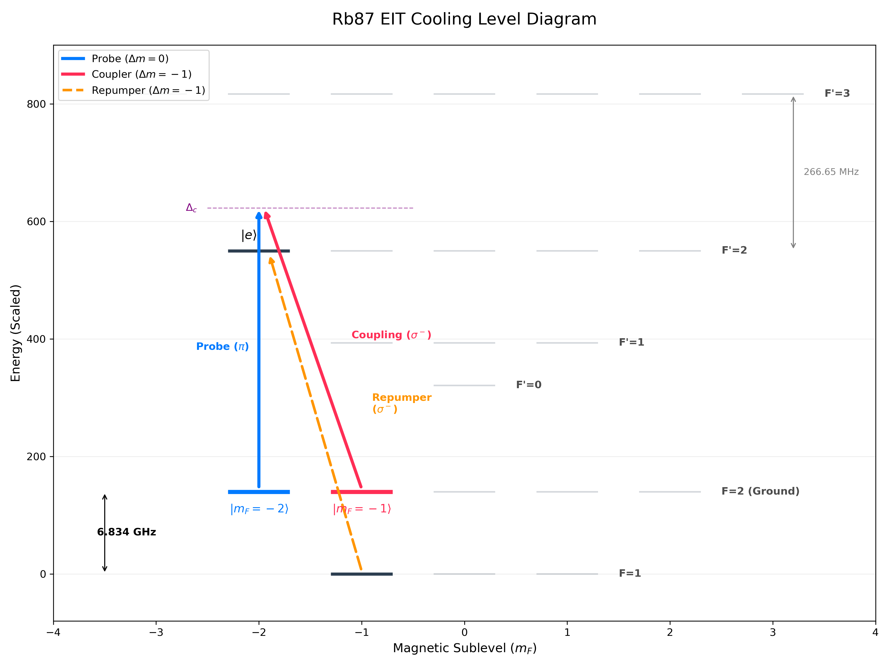
</p>

In the 24-level $^{87}$ Rb simulation, we specifically target the extreme "edge" magnetic sublevels (e.g., $m_F = -2$) rather than central states (e.g., $m_F = 0$). This is done to create a **closed optical cycle** by strictly limiting where the atom can decay.

Because of quantum dipole selection rules ($\Delta m_F = 0, \pm 1$), an atom in the excited state $|F'=2, m_F=-2\rangle$ wants to decay to $m_F = -3, -2,$ or $-1$. Since the $m_F = -3$ state does not exist in the ground manifolds, the atom is funneled into exactly **three possible ground states**:

1. $|F=2, m_F=-2\rangle$ *(Immediately re-absorbs the **Probe** laser)*
2. $|F=2, m_F=-1\rangle$ *(Immediately re-absorbs the **Coupling** laser)*
3. $|F=1, m_F=-1\rangle$ *(Rescued by the **Repumper** laser)*

If we used a central state like $m_F = 0$, the excited atom could decay into **six** different ground states across the $F=1$ and $F=2$ manifolds. Atoms would constantly scatter into "dark" sublevels where the primary lasers cannot reach them, completely breaking the EIT cooling cycle.

---

### Total Hilbert Space

The full system is

$$
\mathcal{H} = \mathcal{H}_{\text{atom}} \otimes \mathcal{H}_{\text{motion}},
$$

where the motional degree of freedom is a harmonic oscillator with operators

$$
a,\quad a^\dagger,\quad n = a^\dagger a,
$$

and trap frequency $\nu$.

Light–motion coupling is included in the Lamb–Dicke regime ($\eta \ll 1$):

$$
e^{ikx} \approx 1 + i\eta (a + a^\dagger).
$$

---

### Hamiltonian

The Hamiltonian is written as

$$
H = H_{\text{free}} + H_{\text{Zeeman}} + H_{\text{int}}.
$$

#### Free Hamiltonian

$$
H_{\text{free}} = \sum_i E_i |i\rangle\langle i| + \nu a^\dagger a.
$$

#### Zeeman Shifts (Full Model)

An external magnetic field lifts the degeneracy of the $m_F$ states:

$$
H_{\text{Zeeman}} = \sum_i g_F \mu_B B m_F |i\rangle\langle i|.
$$

#### Light–Atom Interaction

In general form, the interaction for a given laser field is:

$$
H_{\text{field}} = \sum_{g,e,q} \frac{\Omega}{2} C_{g,e}^{(q)} |e\rangle\langle g| + \text{h.c.}
$$

For the **EIT cooling beams** (probe and coupling), motional coupling is explicitly included:

$$
H_{\text{EIT}} = \sum_{g,e,q} \frac{\Omega_{\text{EIT}}}{2} C_{g,e}^{(q)} |e\rangle\langle g| \left(1 + i\eta(a + a^\dagger)\right) + \text{h.c.}
$$

For the **repump beam**, which serves strictly to recycle lost population rather than drive motional transitions, the motional sidebands are neglected. It acts purely on the "lost" ground states $g_{\text{lost}}$ (e.g., $F=1$):

$$
H_{\text{repump}} = \sum_{g_{\text{lost}},e,q} \frac{\Omega_{\text{rep}}}{2} C_{g,e}^{(q)} |e\rangle\langle g_{\text{lost}}| + \text{h.c.}
$$

The total interaction is $H_{\text{int}} = H_{\text{EIT}} + H_{\text{repump}}$.

---

In the 3-level case, the repumper and Zeeman shifts are absent, and the Hamiltonian reduces strictly to:

$$
H = \Delta_p |g_1\rangle\langle g_1| + \Delta_c |g_2\rangle\langle g_2| + \nu a^\dagger a
$$

$$+ \frac{\Omega_c}{2}(\sigma_{e g_2} + \sigma_{g_2 e})$$
$$+ \frac{\Omega_p}{2}\left[\sigma_{e g_1}(1 + i\eta(a+a^\dagger)) + \text{h.c.}\right] $$

with

$$
\sigma_{e g_i} = |e\rangle\langle g_i|.
$$

> **Note on Beam Geometry:** In this specific 1D representation of the 3-level system, we assume a beam configuration where the strong coupling laser propagates orthogonally to the trap axis (thus its effective Lamb-Dicke parameter is zero, $\eta_c = 0$), while the probe laser propagates along the motional axis. In the generalized 24-level Hamiltonian, motional coupling can be applied to any beam depending on the chosen laboratory geometry.

---

### Lindblad Master Equation

The system evolves according to

$$
\frac{d\rho}{dt} = -i[H,\rho] + \mathcal{L}(\rho),
$$

with dissipator

$$
\mathcal{L}(\rho) = \sum_k \left( L_k \rho L_k^\dagger - \frac{1}{2}\{L_k^\dagger L_k, \rho\} \right).
$$

---

### Collapse Operators

#### 3-Level Model

Spontaneous emission from the excited state symmetrically into both ground states. We define the Lindblad jump operators $L$:

$$
L_1 = \sqrt{\frac{\gamma}{2}}\, |g_1\rangle\langle e|, \qquad
L_2 = \sqrt{\frac{\gamma}{2}}\, |g_2\rangle\langle e|.
$$

---

#### 24-Level Model


All allowed decay channels are included explicitly, strictly obeying dipole selection rules. This realistic decay mechanism is what necessitates the repumper, as atoms spontaneously fall out of the active EIT subspace. To avoid notational conflict with the Clebsch-Gordan coefficients ($C_{g,e}^{(q)}$), we denote the Lindblad jump operators as $L$:

$$
L_{e \to g}^{(q)} = \sqrt{\gamma}\, C_{g,e}^{(q)} \, |g\rangle\langle e|,
$$

for all $g,e$ manifolds and polarizations $q \in \{-1,0,1\}$. 

In the full Hilbert space, these operators act trivially on the motion:

$$
L_{e \to g}^{(q)} \rightarrow L_{e \to g}^{(q)} \otimes \mathbb{I}_{\text{motion}}.
$$

---

### Steady-State Spectrum

The steady state satisfies

$$
\frac{d\rho}{dt} = 0,
$$

leading to

$$
\rho_{ss}.
$$

The absorption spectrum is defined as the total excited-state population:

$$
A(\Delta_p) = \mathrm{Tr}(\rho_{ss} P_e),
$$

where

$$
P_e = \sum_e |e\rangle\langle e|.
$$

In the 3-level case:

$$
A(\Delta_p) = \langle e|\rho_{ss}|e\rangle.
$$

Sidebands appear at

$$
\Delta_p = \Delta_c \pm \nu.
$$

---

### Time-Dependent Cooling Dynamics

The time evolution follows the master equation. The key observable for evaluating cooling performance is the mean phonon number:

$$
\langle n(t)\rangle = \mathrm{Tr}(a^\dagger a \rho(t)).
$$

In the stochastic Monte Carlo wave-function picture, the density matrix is reconstructed via:

$$
\rho(t) = \mathbb{E}\left[|\psi(t)\rangle\langle\psi(t)|\right].
$$

---

### Projectors and Observables (Full Model)

To resolve the complex dynamics and verify the efficiency of the optical pumping and repumping, projectors onto specific subspaces are tracked:

Total excited-state population:
$$P_e = \sum_e |e\rangle\langle e|.$$

Population in the target active manifold (e.g. $F'=2$):
$$P_{e2} = \sum_{e \in F'=2} |e\rangle\langle e|.$$

Leakage to unwanted excited states (e.g. $F'=3$):
$$P_{e3} = \sum_{e \in F'=3} |e\rangle\langle e|.$$

Population lost to uncoupled dark ground states (the target of the repumper):
$$P_{\text{leak}} = \sum_{g \neq g_{\text{target}}} |g\rangle\langle g|.$$

---

### Structural Difference Between the Two Descriptions

The formal structure of the master equation is identical between the two models, but the level of physical resolution dictates the system dynamics.

In the 3-level model, all atomic sums collapse to a single defined transition:

$$
\sum_{g,e} \rightarrow \text{single } (g_1,g_2,e).
$$

In the full model, all allowed couplings are retained:

$$
\sum_{g,e,q} \rightarrow \text{complete hyperfine and Zeeman structure}.
$$

The $\Lambda$ system guarantees perfect dark-state interference and uninterrupted cooling by definition. In contrast, the 24-level model embeds this $\Lambda$ system within a highly coupled structure. Destructive interference is compromised by off-resonant scattering, and population spontaneously leaks into isolated ground states, thereby requiring a dedicated repump field to artificially restore the closed loop necessary for EIT cooling.


---

##  Simulation Parameters

All energy scales in this simulation are normalized and defined in units of the spontaneous emission rate $\gamma$. 

### 1. The 3-Level System 
In the simplified ideal $\Lambda$-system, we ignore magnetic fields and absolute energy scales to focus purely on the EIT interference mechanics. 

**Core Variables:**
- $\gamma$: Spontaneous emission rate (set to 1.0)
- $\nu$: Trap frequency (harmonic oscillator)
- $\Delta_c, \Delta_p$: Control and Probe laser detunings
- $\Omega_c, \Omega_p$: Control and Probe Rabi frequencies
- $\eta$: Lamb-Dicke parameter (spatial coupling to motion)

To achieve optimal ground-state cooling, the control field power is explicitly tuned to satisfy the **EIT cooling condition (Stark-shift matching)**, which aligns the dark state with the red motional sideband:
$$
\Omega_c = \sqrt{4|\Delta_c|\nu}
$$

#### Parameters Used
| Parameter | Symbol | Value |
| :--- | :--- | :--- |
| Spontaneous Emission | $\gamma$ | $1.0$ |
| Trap Frequency | $\nu$ | $0.5 \gamma$ |
| Coupling Detuning | $\Delta_c$ | $15.0 \gamma$ |
| Probe Rabi Frequency | $\Omega_p$ | $0.3 \gamma$ |
| Lamb-Dicke Parameter | $\eta$ | $0.35$ |
| Max Phonon Limit | $N_{vib}$ | $25$ |

---

### 2. The 24-Level $^{87}$ Rb System 
In the realistic Rubidium-87 model, parameters are scaled to actual laboratory values. The $D_2$ line transition ($\lambda = 780$ nm) has a natural linewidth of $\gamma = 2\pi \times 6.067$ MHz. 

Because we introduce a quantizing magnetic field ($B$), the Zeeman sublevels shift according to:
$$\Delta E_Z = g_F \mu_B B m_F $$

To successfully drive the cooling transition, the center frequency of the probe laser ($\Delta_p$) must be offset to compensate for the relative Zeeman shift between the target ground states:
$$\Delta_p = \Delta_c - (g_{g2}m_{g2} - g_{g1}m_{g1})\mu_B B$$
Additionally, an off-resonant **Repumper Laser** ($\Omega_{\text{repump}}$) is introduced to prevent atoms from accumulating in the $F=1$ dark states during the cooling cycle.

#### Parameters Used
| Parameter | Symbol | Value | Physical Equivalent |
| :--- | :--- | :--- | :--- |
| Scaling Factor | $\gamma$ | $1.0$ | $6.067$ MHz |
| Trap Frequency | $\nu$ | $0.016 \gamma$ | $\approx 100$ kHz |
| Coupling Detuning | $\Delta_c$ | $+12.0 \gamma$ | $+72.8$ MHz |
| Probe Rabi Freq. | $\Omega_p$ | $0.15 \gamma$ | $0.9$ MHz |
| Repump Rabi Freq. | $\Omega_{\text{repump}}$ | $0.5 \gamma$ | $3.0$ MHz |
| Magnetic Field | $B$ | $4.0$ Gauss | $4.0$ Gauss |
| Bohr Magneton | $\mu_B$ | $1.399 \text{ MHz/G}$ | $1.4$ MHz/G |
| Lamb-Dicke Parameter| $\eta$ | $0.25$ | $0.25$ |
| Max Phonon Limit | $N_{vib}$ | $15$ | $15$ |


### Solver & Execution Parameters
Beyond the physical constants, the simulation requires specific numerical parameters to balance computational accuracy with RAM and execution time. 

These are set within the individual solver scripts (`simulation.py`, `simulation_n_Rb_montecarlo.py`, etc.):

#### Master Equation Solver (`mesolve`)
Used for the 3-Level system and heavily truncated 24-Level systems. It computes the exact density matrix over time.
*   **`t_stop`**: Total simulation time (e.g., `3500` arbitrary units).
*   **`t_points`**: Number of time steps saved to the output array (e.g., `200`).
*   **`nsteps`**: Maximum internal ODE solver steps per time interval. Must be increased for highly oscillatory systems (e.g., `10000`) to prevent QuTiP integration errors.
*   **`store_states`**: Set to `True` to save the full density matrix at each step (required for the 3-level animation), or `False` to save RAM and only return expectation values.

#### Monte Carlo Solver (`mcsolve`)
Used for the full 24-level system with motion. It averages quantum jumps to approximate the density matrix without storing the full massive tensor in RAM.
*   **`t_total`**: Total simulation time (e.g., `500000.0`). EIT cooling in the full Rb model takes significantly longer to reach steady state than the ideal 3-level model.
*   **`n_points`**: Number of data points to record (e.g., `5000`).
*   **`ntraj`**: Number of quantum trajectories to average (e.g., `100`). **Higher = smoother curve but longer compute time.**
*   **`store_states`**: Set to `False`. Storing full states for 100 trajectories of a $600 \times 600$ matrix will immediately crash standard computer memory.

#### Parameters

| Parameter | Function | 3-Level (`mesolve`) | 24-Level (`mcsolve`) |
| :--- | :--- | :--- | :--- |
| `t_stop` / `t_total` | Total simulated time | `3500` | `500000` |
| `t_points` / `n_points` | Output resolution | `200` | `5000` |
| `nsteps` | Internal ODE solver steps | `10000` | Configured internally |
| `ntraj` | Monte Carlo trajectories | *N/A* | `100` |
| `store_states` | Save full quantum state | `True` | `False` |

---

## How to Run

This project is divided into separate directories based on the physical model's complexity. You can run the simplified models for quick intuition, or the full 24-level model for lab-realistic data.

### 1. Setup Environment
First, clone the repository and install the required dependencies:

```bash
# From the root directory of the project
pip install -r requirements.txt
```

---

### 2. The 3-Level System
This pipeline simulates the perfect Lambda-system to generate clear, intuitive animations of EIT cooling. 

### Quick Fano Sandbox
To test the math of a Fano resonance without any EIT or harmonic oscillator dynamics, run the standalone script:

```bash
cd ../Fano
python Fano_profile.py
```


**Step 2.1: Execute the numerical solver**
This script uses QuTiP's `mesolve` to calculate the exact time evolution. It saves the matrix data into a new `results/` folder.
```bash
cd EIT_cooling
python simulation.py
```

**Step 2.2: Visualize the results**
Run the plotting script to read the data and generate the 3-panel interactive animation (saved in `plots/`).
```bash
python plot.py
```

---

### 3. The 24-Level 87Rb System 
This pipeline models the full physical reality of a Rubidium-87 atom. *Note: All physical parameters (lasers, trap frequency, B-field) are centralized in `EIT_cooling_Rb/config.py`.*

```bash
cd ../EIT_cooling_Rb
```

#### A. Generate the Level Diagram
Visualize the atomic structure and allowed transitions:
```bash
python level_diagram.py
```

#### B. Map the Fano/EIT Spectrum (Steady-State)
Find the optimal cooling parameters by calculating the steady-state absorption spectrum:
```bash
# 1. Scan the probe laser frequencies
python fano.py

# 2. Plot the resulting Fano profile and optical pumping leaks
python plot_fano.py
```

#### C. Simulate Cooling Dynamics (Time Evolution)
To see the atom actually cool down (tracking mean phonon number over time), you have two solver options:

**Option 1: Monte Carlo Solver (Recommended for large phonon numbers)**
Uses `mcsolve` to average individual quantum trajectories, saving RAM.
```bash
# 1. Run the Monte Carlo trajectories
python simulation_n_Rb_montecarlo.py

# 2. Plot the cooling curve
python plot_n_MC.py
```

**Option 2: Exact Master Equation Solver (For small systems)**
Uses `mesolve`. Only recommended if you restrict motional Fock states to a very small number to avoid memory limits.
```bash
# 1. Run the exact ODE solver
python simulation_n_Rb.py

# 2. Plot the exact cooling curve
python plot_n.py
```

---

##  Simulation Results

### 1. The 3-Level System 

The animation generated by the simplified pipeline (`EIT_cooling/plot.py`) provides a synchronized, three-panel view of the quantum cooling process:

*   **Phonon Distribution (Left):** A real-time bar chart showing the population of vibrational Fock states $|n\rangle$ shifting from a hot initial state ($n = 15$) down towards the motional ground state ($n = 0$).
*   **EIT Spectrum (Center):** The steady-state Fano profile illustrating the "dark" transparency window perfectly aligned with the carrier frequency, and the absorption peak aligned with the Red Sideband (the cooling transition).
*   **Cooling Curve (Right):** The expectation value of the average phonon number $\langle n \rangle$ decaying over time as heat is extracted from the system.

<p align="center">
  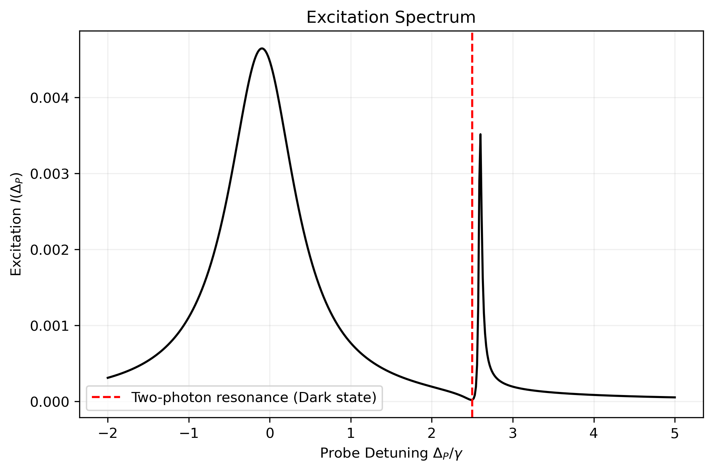
</p>

<p align="center">
  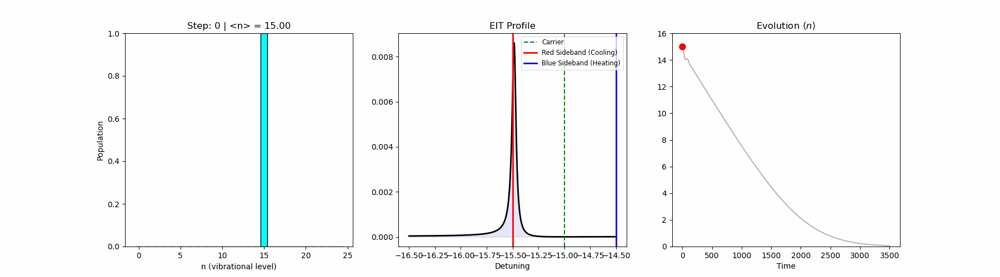
</p>

> **Disclaimer on the Lamb-Dicke Approximation:** For illustrative purposes, this simulation starts from a relatively hot initial state ($n = 15$) with $\eta = 0.35$. At $t=0$, the strict Lamb-Dicke condition $\eta \sqrt{\langle n \rangle + 1} \ll 1$ is weakly violated (evaluating to $\approx 1.4$). This means the truncated linear approximation used in the interaction Hamiltonian ($1 + i\eta(a + a^\dagger)$) slightly underestimates higher-order motional sideband transitions during the very first stages of the dynamics. However, as the system rapidly extracts heat and cools towards $\langle n \rangle \approx 0$, it strictly enters the deep Lamb-Dicke regime, ensuring that the computed steady-state cooling limits are mathematically exact.
---

### 2. The 24-Level $^{87}$ Rb System 

The outputs from the Rubidium-87 pipeline reveal the exact complexities you will encounter in a real-world laboratory environment, including off-resonant scattering and optical pumping inefficiencies:

*   **Realistic Fano Spectrum & Efficiency Leaks:** 
    Generated by `plot_fano.py`, thisplot isolates the exact $F'=2$ cooling signal from the  background noise generated by the nearby $F'=3$ state. It maps out "optical pumping leaks", showing how many atoms accidentally fall into spurious $F=2$ sublevels or the $F=1$ manifold if the Repumper laser is poorly tuned.
    
*   **Monte Carlo Cooling Dynamics:** 
    Generated by `plot_n_MC.py`, this curve shows the true time-evolution of the atomic temperature (mean phonon number $\langle n \rangle$). Unlike the perfect 3-level model, this curve demonstrates the slower, highly realistic cooling rate dictated by Clebsch-Gordan probability weightings, Zeeman shifts, and random spontaneous emission trajectories.

<p align="center">
  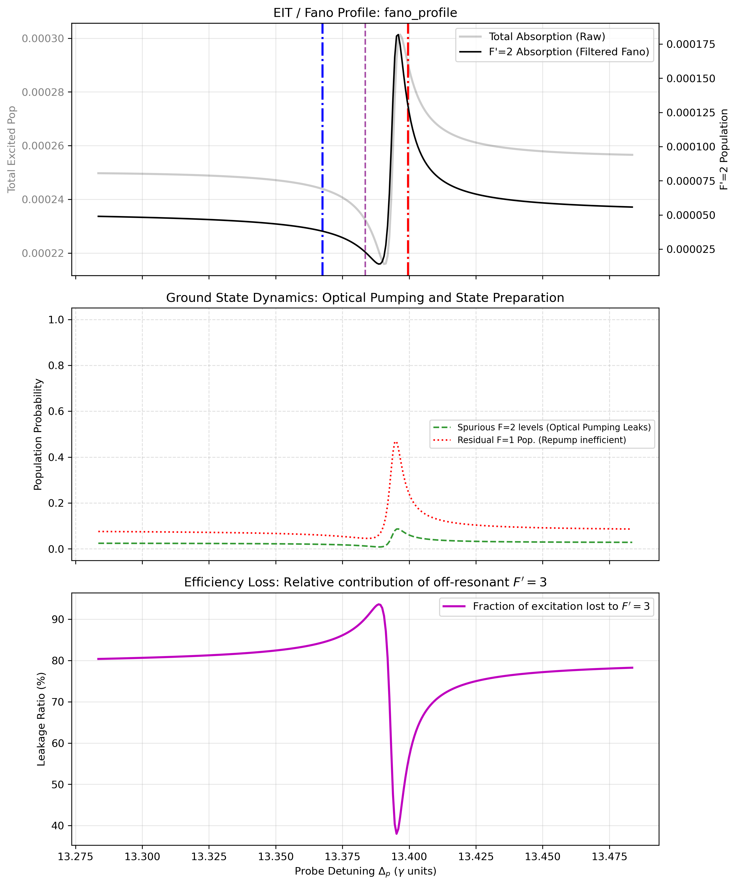
</p>

<p align="center">
  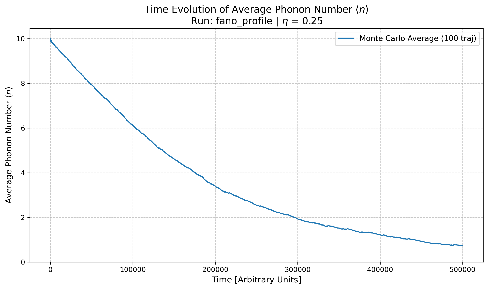
</p>

The output images currently have the suffix fano_profile because they correspond to the default RUN_NAME defined in config.py. If you adjust the physics parameters, you can simply change this variable (for example, to RUN_NAME = "fano_profile_diff_detuning"). The simulation will then automatically generate and save a distinct set of results under that new name, preventing your previous data from being overwritten.


## Time Evolution Solvers: `mesolve` vs `mcsolve`

In this project, we employ two distinct numerical approaches provided by the QuTiP library to simulate the time evolution of the open quantum system. Understanding the difference between these solvers is crucial for navigating the computational limits of large Hilbert spaces.

### 1. The Master Equation Solver (`mesolve`)
The `mesolve` function integrates the Lindblad Master Equation deterministically to find the exact time evolution of the system's full **density matrix** ($\rho$).

* **How it works:** It calculates the precise statistical ensemble average of the system at every time step, accounting for both coherent evolution and incoherent dissipation (spontaneous emission).
* **When to use it:** `mesolve` is ideal for small quantum systems, such as our simplified 3-level toy model. It provides exact, smooth curves without any statistical noise.
* **The limitation ($O(N^2)$ scaling):** The density matrix scales quadratically with the number of states. For our full $^{87}\text{Rb}$ system with 24 internal states and a truncation of 15 vibrational phonons, the Hilbert space size is $N = 24 \times 15 = 360$. The density matrix therefore contains $360^2 = 129,600$ elements. Solving coupled differential equations for a matrix this size is extremely memory-intensive and computationally slow.

### 2. The Monte Carlo Wavefunction Solver (`mcsolve`)
To bypass the memory bottleneck of the density matrix, `mcsolve` uses the **Quantum Jump Approach** (Monte Carlo wavefunction method) to simulate the time evolution of individual **state vectors** ($|\psi\rangle$).

* **How it works:** Instead of simulating the entire statistical ensemble at once, it simulates a single atom undergoing coherent evolution interrupted by random, stochastic "quantum jumps" (representing spontaneous emission events). By calculating many independent trajectories (`ntraj`) and averaging them together, the result converges to the Master Equation solution.
* **When to use it:** `mcsolve` is strictly necessary for large, complex systems like our full 24-level Rubidium simulation. It is also the physically accurate way to observe the trajectory of a *single* atom, rather than an ensemble.
* **The advantages ($O(N)$ scaling & Parallelization):** Because it evolves state vectors instead of density matrices, the memory requirement scales linearly. Furthermore, because each quantum trajectory is statistically independent, `mcsolve` automatically parallelizes the computation across all available CPU cores, vastly reducing simulation time for large Hilbert spaces.
* **The limitation:** The output inherently contains statistical noise. Obtaining a perfectly smooth curve requires averaging a large number of trajectories, which can take time, though it avoids the hard memory limits of `mesolve`.

**Summary for this Project:**
* Run `simulation.py` (`mesolve`) for quick, exact results on the simple 3-level EIT model.
* Run `simulation_n_Rb_montecarlo.py` (`mcsolve`) to handle the massive state space of the realistic $^{87}\text{Rb}$ EIT cooling dynamics without crashing your machine's RAM.

The plot obtained above with mcsolve took 8 hours, mesolve obtained only 70.000 steps in 3 days of continuous running.
<p align="center">
  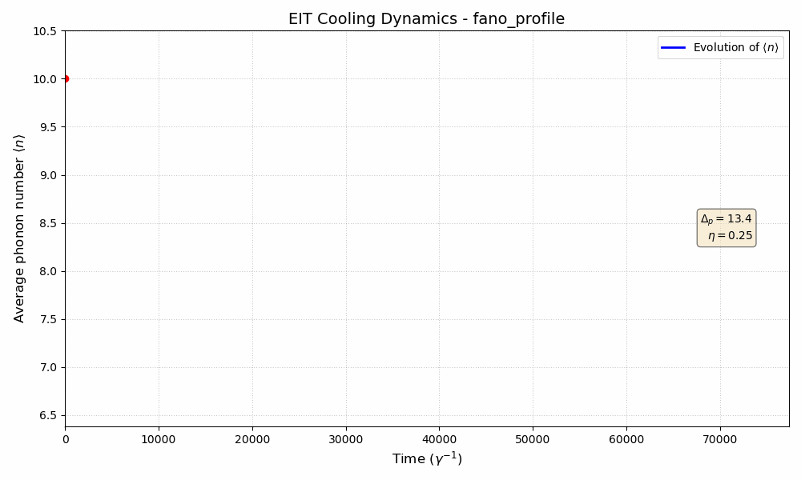
</p>

---
## Repumper Optimization: Mitigating F=1 Population Trapping

During our EIT cooling simulations, we observed an accumulation of unwanted atomic population leaking into the `F=1` ground state manifold. This dark state trapping removes atoms from the active `F=2` cooling cycle, creating "dead time" that severely limits the overall cooling rate. 

To resolve this, we systematically optimize the repumper laser parameters. The goal is to find the ideal intensity that pumps atoms back into the `F=2` manifold as rapidly as possible, without introducing excessive power broadening that would compromise the narrow EIT Fano resonance.

### Directory Structure & Data

We have set up a new folder and script to easily compare the system's dynamics across different repumper powers:

* **Simulation Data:** The results for each parameter sweep are stored in the root `results_fano/` directory. Each run is saved in its own subfolder following the naming convention `fano_profile_rep[VALUE]` (e.g., `fano_profile_rep0.2`, `fano_profile_rep0.5`).
* **Plotting Environment:** The script to analyze these runs is located inside the `repumper/plot Fano experiments/` directory.

### How to Run the Comparative Plot

To visualize the overlaid Fano profiles, optical pumping efficiency, and $F'=3$ leakage for all repumper variations simultaneously, execute the plotting script from your terminal:

```bash
# 1. Navigate to the experiments directory
cd "repumper/plot Fano experiments/"

# 2. Execute the plotting script (replace with your actual python filename)
python plot_comparison.py
```

The script will automatically traverse the directory tree, detect all `fano_profile_rep...` folders, extract their data, and generate a single, color-coded summary chart (`plot_fano_comparison_all.png`) saved directly in your current working directory.

<p align="center">
  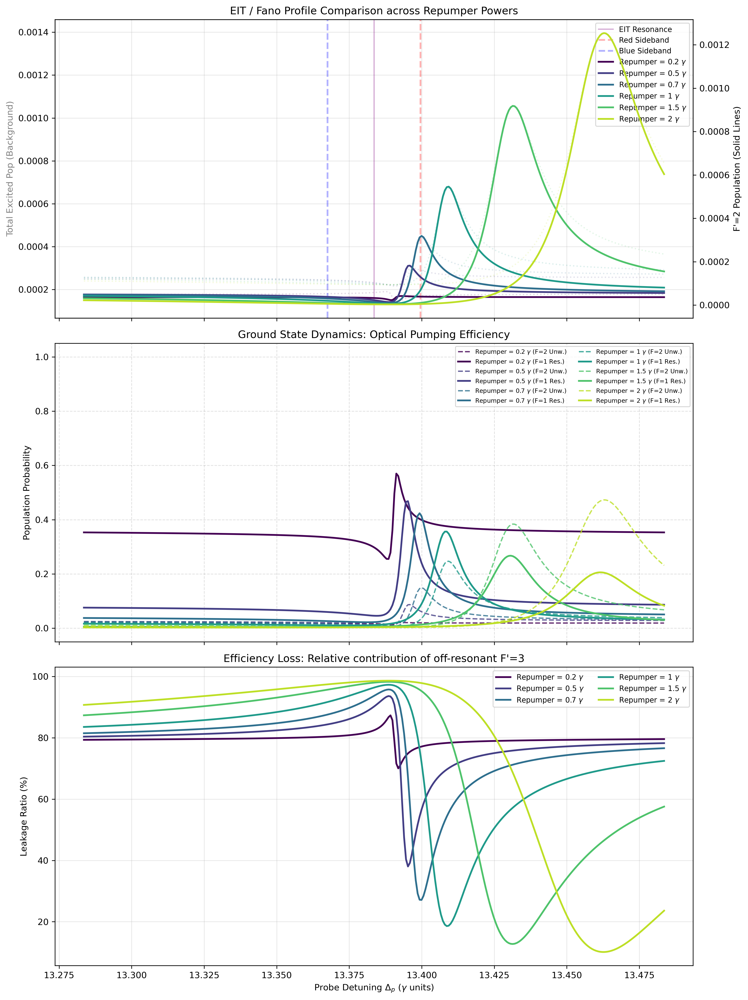
</p>

The analysis reveals a fundamental physical trade-off between dark-state depopulation and power-induced resonance shifts:


* **Top Panel (Fano Profile and AC Stark Shift):** 
  While increasing the repumper intensity mitigates $F=1$ population trapping, it simultaneously induces a AC Stark shift (light shift). The intense repumper field dresses the atomic states, which manifests macroscopically as a positive frequency shift (toward higher probe detuning, $\Delta_p$) of the entire Fano profile. This shift affects both the EIT transparency minimum (the dark resonance) and the highly asymmetric absorption maximum.

* **Optimal Parameter Regime ($\Omega_{repump} = 0.7 \gamma$):**
  The physical objective of resolved-sideband EIT cooling is to minimize the scattering rate at the carrier frequency (to suppress heating) while maximizing the scattering rate exactly at the red vibrational sideband. 
  The trace corresponding to **0.7 $\gamma$ (dark blue)** demonstrates the optimal configuration for these specific parameters. At this intensity, the magnitude of the AC Stark shift precisely aligns the Fano absorption maximum with the atomic Red Sideband (dashed red line). For higher intensities (e.g., 1.5 $\gamma$ or 2.0 $\gamma$), the induced light shift is excessive, displacing the absorption peak beyond the red sideband and decoupling the atom from the cooling transition.

* **Middle Panel (Ground State Population Trapping):** 
  This panel quantifies the efficacy of optical pumping. At low repumper intensities (e.g., $\Omega_{repump} = 0.2 \gamma$, dark purple trace), off-resonant scattering leads to significant population trapping in the uncoupled $F=1$ ground state manifold (approximately 35%). This effectively isolates these atoms from the active $F=2 \leftrightarrow F'=2$ cooling cycle, severely limiting the overall cooling rate. Increasing the repumper Rabi frequency to 0.7 $\gamma$ and above sufficiently depletes this residual population, restoring the ensemble to the active cooling transition.

* **Bottom Panel (Efficiency Loss / Off-Resonant Scattering):** 
  This panel plots the fractional population excitation to the off-resonant $F'=3$ state. The deep minima correspond to the EIT window, where destructive quantum interference suppresses atomic excitation.

**Conclusion:**
Optimization of the multi-level EIT cooling scheme requires a strict balance. The repumper intensity must be high enough to continuously deplete the $F=1$ dark state, but strictly bounded to prevent the AC Stark shift from detuning the Fano absorption peak away from the red vibrational sideband. For the current parameter set, **$\Omega_{repump} = 0.7 \gamma$** represents the exact theoretical optimum, maximizing the cooling transition probability while preserving the destructive interference on the carrier transition.

## Probe Optimization
Following the same pipeline of the rempumper optimization, we optimized the probe power:
### Results & Analysis: Probe Rabi Frequency Optimization

<p align="center">
  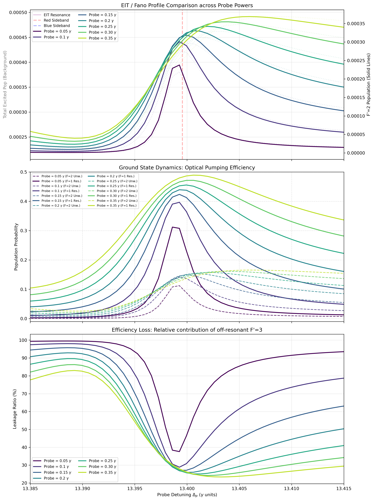
</p>

The generated plot illustrates the dependence of the EIT cooling dynamics on the probe Rabi frequency ($\Omega_{p}$), evaluated across a range from $0.05 \gamma$ to $0.35 \gamma$. The analysis reveals a fundamental physical trade-off between excitation amplitude and spectral resolution, governed by power broadening:

* **Top Panel (Fano Profile and Power Broadening):** 
  * **Resolution of the Asymmetry:** EIT cooling relies not just on a narrow absorption peak, but on the steep *asymmetry* of the Fano profile. The atom must experience near-zero absorption at the carrier frequency ($\Delta_p = \text{EIT Resonance}$) and maximum absorption at the red sideband. At low probe intensities ($\Omega_p = 0.05 \gamma$ to $0.10 \gamma$), this steep gradient is preserved. As power increases, the "valley" of the dark resonance fills in and the peak broadens, destroying the contrast. This means the atom becomes increasingly likely to scatter carrier photons, which causes random recoil heating and raises the final steady-state temperature $\langle n \rangle$.
* **Probe-Induced AC Stark Shift:** While the repumper laser induces a strong light shift, the top panel demonstrates that an intense probe laser also contributes to the AC Stark effect. Looking closely at the traces from $0.15 \gamma$ to $0.35 \gamma$, the apex of the absorption peak systematically drifts to the right (higher detuning). At high powers, the peak completely detaches from the target Red Sideband (dashed red line).

* **Middle Panel (Ground State Population Dynamics):** 
  This panel quantifies the parasitic optical pumping induced by the probe laser. A stronger probe laser increases the total photon scattering rate of the system. This elevated scattering overwhelms the repumper and coupling lasers, systematically driving more atomic population into the uncoupled $F=1$ ground state manifold (solid lines) and spurious $F=2$ Zeeman sublevels (dashed lines). Consequently, operating at high probe powers inherently degrades the steady-state preparation of the target initial cooling state.

* **Bottom Panel (Efficiency Loss / Off-Resonant Scattering):** 
  This panel plots the fractional population leakage to the off-resonant $F'=3$ state. While higher probe intensities decrease the *relative* fractional leakage (by strongly driving the target $F'=2$ transition and lowering the baseline ratio), the EIT transparency window becomes excessively broad. A broad transparency window fails to provide the sharp, steep dispersive features necessary for optimal Fano interference.

**Conclusion:**
Optimization of the probe laser requires minimizing the applied power to preserve the narrow spectral features of the EIT dark resonance. While higher powers yield a larger absolute excitation signal, the resulting power broadening completely washes out the vibrational sideband resolution, leading to excess carrier scattering and heating. Furthermore, an overly intense probe disrupts steady-state optical pumping. For the current parameter set, operating in the weak-probe regime (**$0.10 \gamma$**) is theoretically optimal, maintaining a sharp Fano peak cleanly aligned with the target red sideband.

---

##  Detuning Optimization

Following the same pipeline of the previous optimizations, we optimized the coupling laser detuning ($\Delta_c$):

The generated images illustrate the dependence of the EIT cooling dynamics on the coupling detuning ($\Delta_c$), evaluated across a range from $+6.0 \gamma$ to $+13.0 \gamma$. The analysis reveals how the interplay between the two-photon resonance condition and AC Stark shifts dictates the precise spectral alignment of the Fano profile:


<p align="center">
  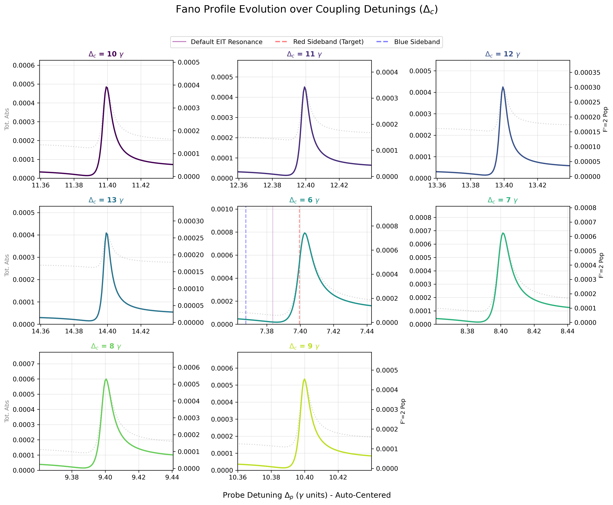
</p>

* **Image 1 (Fano Profile and Spectral Alignment):**
* *Targeting the Sideband:* Efficient EIT cooling requires precise overlap between the maximum of the absorption profile (the Fano peak) and the target motional sideband of the trap. Because the intense coupling laser induces a significant AC Stark shift, the position of the dark resonance drifts systematically as a function of $\Delta_c$. At lower detunings ($+6.0 \gamma$ to $+8.0 \gamma$), the peak falls short of the target Red Sideband (dashed red line). It is important to note that the absolute amplitude of the Fano absorption peak visibly decreases as $\Delta_c$ increases (dropping from a maximum of $\sim 0.0008$ at $+6.0 \gamma$ to $\sim 0.0004$ at $+13.0 \gamma$). This reduction in maximum excitation probability inherently lowers the achievable cooling rate. At exactly $\Delta_c = +9.0 \gamma$, the system finds the optimal compromise: the peak perfectly aligns with the target red sideband while maintaining a sufficiently high excitation amplitude.

<p align="center">
  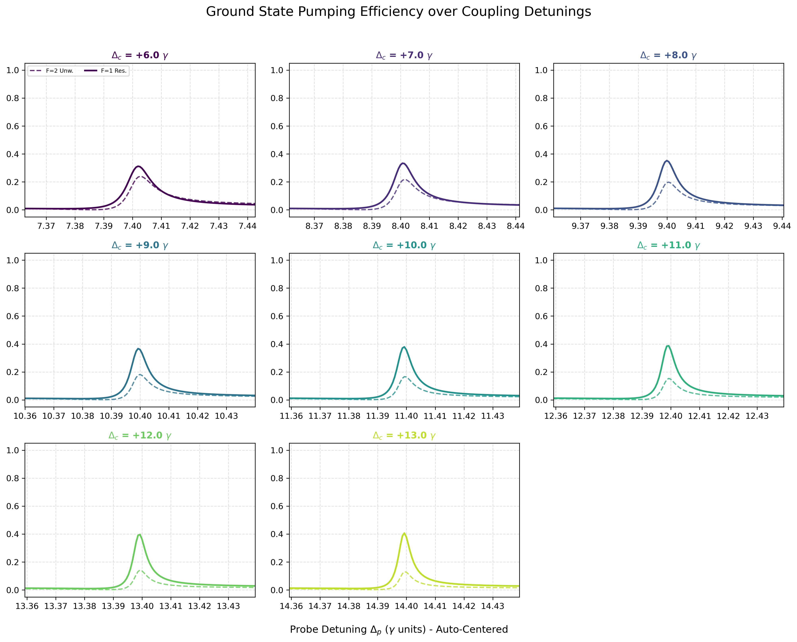
</p>

* **Image 2 (Ground State Pumping Efficiency):**
This image tracks the parasitic optical pumping into the uncoupled $F=1$ manifold (solid lines) and spurious $F=2$ Zeeman sublevels (dashed lines). The peak of these unwanted populations shifts in frequency space and slightly increases in amplitude at higher $\Delta_c$ values, confirming that optimal spectral alignment remains the dominant factor for successful cooling.

<p align="center">
  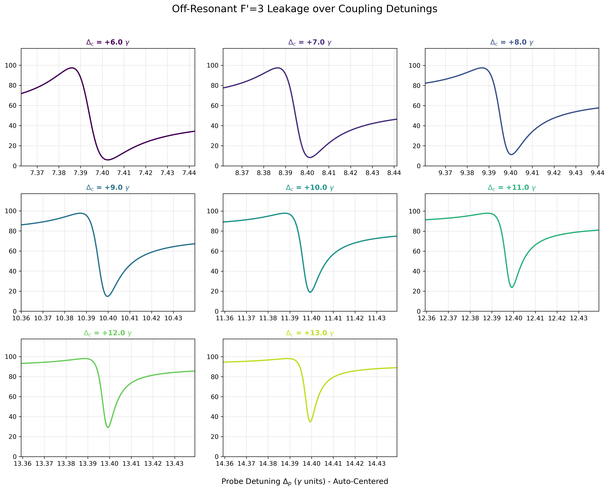
</p>

* **Image 3 (Efficiency Loss / Off-Resonant $F'=3$ Leakage):**
This image plots the fractional population leakage to the off-resonant $F'=3$ state. The distinct "dip" represents the EIT transparency window. At $\Delta_c = +9.0 \gamma$, this interference minimum is properly positioned to ensure a sharp, deep suppression of carrier scattering, preventing unwanted recoil heating.

**Conclusion**

We chose $\Delta_c = +9.0 \gamma$ as the optimal operational parameter, as it guarantees near-perfect alignment of the Fano absorption maximum with the target red sideband while maintaining strong suppression of carrier heating.

---

# Final Cooling Evolution

By applying the complete set of previously optimized parameters (repumper, probe, and coupling detuning), we studied the overall time evolution of the EIT cooling dynamics. The results demonstrate a highly efficient process, with the system successfully cooling in fewer than $100,000$ steps.

<p align="center">
  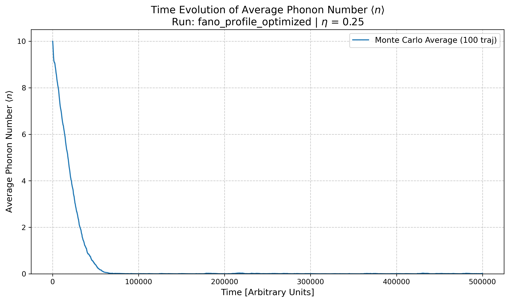
</p>
