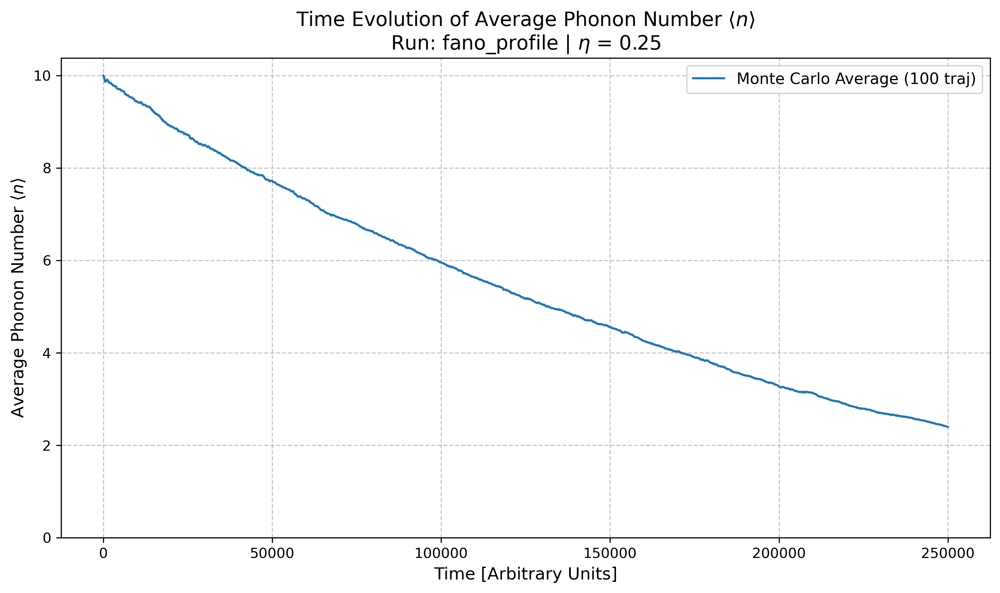

# EIT Cooling of a Trapped Atom

## Status
Work in progress (models under refinement — results may contain inaccuracies)

---

## Overview

This project implements numerical simulations of **Electromagnetically Induced Transparency (EIT) cooling** using QuTiP, at two different levels of complexity:

- **3-level Λ system** (idealized model)
- **24-level $^{87}$Rb system** (realistic hyperfine + Zeeman structure)

The goal is to study how quantum interference enables cooling of a trapped atom to its motional ground state, and how real atomic complexity affects performance.

---

## Theory
For a rigorous mathematical derivation of the physics behind this simulation, you should refer to "Morigi-2018-Cooling the atomic motion with quantum interference.pdf" and "Morigi-2018-Ground state laser cooling using electromagnetically induced transparency.pdf".

---

### 1. The Internal Dynamics and the Dark State
The core of the EIT cooling scheme relies on a $\Lambda$-shaped atomic level configuration driven by two lasers (a coupling/pump laser and a probe/cooling laser) tuned to a two-photon resonance[cite: 1]. 

Due to quantum interference between the two excitation pathways, the atom falls into a coherent superposition known as the **Dark State**:
$$
|\Psi_D\rangle = \frac{1}{\Omega}(\Omega_2|g_1\rangle - \Omega_1|g_2\rangle)
$$
where $\Omega = \sqrt{\Omega_1^2 + \Omega_2^2}$ is the effective Rabi frequency[cite: 1]. This state is completely decoupled from the excited state $|e\rangle$, meaning the probability of carrier absorption vanishes[cite: 1].

### 2. Dressed States and the AC Stark Shift
The interaction with the strong coupling laser creates new "dressed states" in the atom[cite: 1]. These dressed states ($|\psi_+\rangle$ and $|\psi_-\rangle$) have eigenfrequencies that are shifted from the bare atomic resonance:
$$
\delta\omega_\pm = \frac{\Delta \mp \sqrt{\Delta^2 + \Omega^2}}{2}
$$
where $\Delta$ is the laser detuning[cite: 1]. 

In the context of the absorption spectrum, this creates a broad resonance and a very narrow resonance[cite: 2]. The narrow resonance is shifted from the coupling laser's detuning ($\Delta_r$) by the **AC Stark shift** ($\delta$):
$$
\delta = \frac{\sqrt{\Delta_r^2 + \Omega_r^2} - |\Delta_r|}{2}
$$
which creates the characteristic asymmetric Fano-like profile[cite: 2].

### 3. Coupling to the Motion (Lamb-Dicke Regime)
When the atom is trapped in a harmonic potential with frequency $\nu$, its motion is quantized into phonon states $|n\rangle$[cite: 2]. In the Lamb-Dicke regime, the dynamics of the motional state populations $P(n)$ can be described by a rate equation:
$$
\frac{d}{dt}P(n) = \eta^2 \left[ A_- \big( (n+1)P(n+1) - nP(n) \big) + A_+ \big( nP(n-1) - (n+1)P(n) \big) \right]
$$
where $\eta$ is the Lamb-Dicke parameter[cite: 2]. 

The coefficients $A_+$ and $A_-$ represent the transition rates for heating (absorbing a phonon) and cooling (removing a phonon), respectively[cite: 2]. Because of the quantum interference, these rates are fundamentally altered:
$$
A_\pm = \frac{\Omega_g^2}{\gamma} \frac{\gamma^2\nu^2}{\gamma^2\nu^2 + 4[\Omega_r^2/4 - \nu(\nu \mp \Delta)]^2}
$$
where $\Omega_g$ is the cooling laser Rabi frequency, $\Omega_r$ is the coupling laser Rabi frequency, and $\gamma$ is the spontaneous emission rate[cite: 2].

### 4. The Cooling Limit
To achieve ground-state cooling, the system must maximize $A_-$ (cooling) while minimizing $A_+$ (heating)[cite: 2]. The steady-state mean vibrational quantum number $\langle n_S \rangle$ is found by solving the rate equation:
$$
\langle n_S \rangle = \frac{A_+}{A_- - A_+} = \frac{\gamma^2\nu^2 + 4[\Omega_r^2/4 - \nu(\nu + \Delta)]^2}{4\Delta\nu(\Omega_r^2 - 4\nu^2)}
$$
To minimize $\langle n_S \rangle$, the laser parameters must be tuned such that the AC Stark shift exactly matches the harmonic trap frequency[cite: 2]:
$$
\delta \simeq \nu
$$
When this resonance condition is met, the narrow Fano absorption peak aligns perfectly with the red motional sideband, allowing the system to achieve an optimal steady-state phonon number of[cite: 1]:
$$
\langle n \rangle_\infty^{(min)} = \left(\frac{\gamma}{4|\Delta|}\right)^2
$$
This demonstrates that extremely low temperatures can be achieved by utilizing far-detuned lasers to enhance the asymmetry of the excitation spectrum[cite: 1].

---


## Project Structure
```text
EIT_Cooling_Project/
│
├── requirements.txt
│
├── Fano/                         # Simple Fano spectrum ignoring harmonic oscillator
│   ├── Fano_profile.py  
│   ├── Fano_profile.png     
│
├── EIT_cooling/                  # ── 3-LEVEL SYSTEM ──
│   ├── config.py                 # Parameters 
│   ├── simulation.py             # Lindblad ODE solver (mesolve)
│   ├── plot.py                   # plots and 3-panel animation generator
│   ├── results/                  # Saved .qu numerical arrays
│   └── plots/                    # Output animations (.gif .png)
│
└── EIT_cooling_Rb/                            # ── 24-LEVEL 87Rb SYSTEM ──
    ├── config.py                              # Hyperfine levels, Clebsch-Gordan, B-field parameters
    ├── fano.py                                # Steady-state solver for the Fano/Absorption spectrum
    ├── plot_fano.py                           # Plots the EIT spectrum
    ├── level_diagram.py                       # Generates graphical level diagrams
    ├── simulation_n_Rb.py          # mesolve time evolution solver 
    ├── simulation_n_Rb_montecarlo.py          # Monte Carlo time evolution solver (mcsolve)
    ├── plot_n.py                              # Plots the cooling curve <n> vs time from mesolve data
    ├── plot_n_MC.py                           # Plots the cooling curve <n> vs time from MC data
    ├── results_fano/                          # Saved Fano spectrum data
    ├── results_time/                          # Saved mesolve and mcsolve trajectories and plots
    └── images/                                # Output plots and diagrams
```


## 3-Level and 24-Level EIT Cooling: Full Model Description

### System Definition

The system consists of an atom coupled to a quantized harmonic oscillator. Two different levels of description are used to model the cooling dynamics: an idealized minimal model and a complete real-world atomic model.

In the minimal case, the atom is modeled as a $\Lambda$ (Lambda) system with three states:

$$
|g_1\rangle,\quad |g_2\rangle,\quad |e\rangle.
$$

Two coherent fields with Rabi frequencies $\Omega_p$ (probe) and $\Omega_c$ (coupling) drive the transitions. Their interference produces the dark state

$$
|D\rangle \propto \Omega_c |g_1\rangle - \Omega_p |g_2\rangle,
$$

which traps the population and suppresses excitation when the atom is at rest, allowing for ground-state cooling.

In the full model, the atom is described using all hyperfine and Zeeman sublevels of $^{87}\mathrm{Rb}$. The basis states are defined by

$$
|F, m_F\rangle,
$$

comprising the ground state manifolds

$$
F=1 \ (3\ \text{states}), \quad F=2 \ (5\ \text{states}),
$$

and the excited state manifolds

$$
F' = 0,1,2,3 \ (16\ \text{states}),
$$

yielding a total atomic Hilbert space of

$$
\dim(\mathcal{H}_{\text{atom}}) = 24.
$$

All dipole-allowed transitions are explicitly included, weighted by their Clebsch–Gordan coefficients:

$$
C_{g,e}^{(q)} = \langle F_g, m_g; 1, q \,|\, F_e, m_e \rangle.
$$

In our case the following levels are used:

<p align="center">
  
</p>
WRITE WHY WE USE THESE
---

### Total Hilbert Space

The full system is

$$
\mathcal{H} = \mathcal{H}_{\text{atom}} \otimes \mathcal{H}_{\text{motion}},
$$

where the motional degree of freedom is a harmonic oscillator with operators

$$
a,\quad a^\dagger,\quad n = a^\dagger a,
$$

and trap frequency $\nu$.

Light–motion coupling is included in the Lamb–Dicke regime ($\eta \ll 1$):

$$
e^{ikx} \approx 1 + i\eta (a + a^\dagger).
$$

---

### Hamiltonian

The Hamiltonian is written as

$$
H = H_{\text{free}} + H_{\text{Zeeman}} + H_{\text{int}}.
$$

#### Free Hamiltonian

$$
H_{\text{free}} = \sum_i E_i |i\rangle\langle i| + \nu a^\dagger a.
$$

#### Zeeman Shifts (Full Model)

An external magnetic field lifts the degeneracy of the $m_F$ states:

$$
H_{\text{Zeeman}} = \sum_i g_F \mu_B B m_F |i\rangle\langle i|.
$$

#### Light–Atom Interaction

In general form, the interaction for a given laser field is:

$$
H_{\text{field}} = \sum_{g,e,q} \frac{\Omega}{2} C_{g,e}^{(q)} |e\rangle\langle g| + \text{h.c.}
$$

For the **EIT cooling beams** (probe and coupling), motional coupling is explicitly included:

$$
H_{\text{EIT}} = \sum_{g,e,q} \frac{\Omega_{\text{EIT}}}{2} C_{g,e}^{(q)} |e\rangle\langle g| \left(1 + i\eta(a + a^\dagger)\right) + \text{h.c.}
$$

For the **repump beam**, which serves strictly to recycle lost population rather than drive motional transitions, the motional sidebands are neglected. It acts purely on the "lost" ground states $g_{\text{lost}}$ (e.g., $F=1$):

$$
H_{\text{repump}} = \sum_{g_{\text{lost}},e,q} \frac{\Omega_{\text{rep}}}{2} C_{g,e}^{(q)} |e\rangle\langle g_{\text{lost}}| + \text{h.c.}
$$

The total interaction is $H_{\text{int}} = H_{\text{EIT}} + H_{\text{repump}}$.

---

In the 3-level case, the repumper and Zeeman shifts are absent, and the Hamiltonian reduces strictly to:

$$
H = \Delta_p |g_1\rangle\langle g_1| + \Delta_c |g_2\rangle\langle g_2| + \nu a^\dagger a
$$

$$
+ \frac{\Omega_c}{2}(\sigma_{e g_2} + \sigma_{g_2 e})
+ \frac{\Omega_p}{2}\left[\sigma_{e g_1}(1 + i\eta(a+a^\dagger)) + \text{h.c.}\right],
$$

with

$$
\sigma_{e g_i} = |e\rangle\langle g_i|.
$$

---

### Lindblad Master Equation

The system evolves according to

$$
\frac{d\rho}{dt} = -i[H,\rho] + \mathcal{L}(\rho),
$$

with dissipator

$$
\mathcal{L}(\rho) = \sum_k \left( C_k \rho C_k^\dagger - \frac{1}{2}\{C_k^\dagger C_k, \rho\} \right).
$$

---

### Collapse Operators

#### 3-Level Model

Spontaneous emission from the excited state symmetrically into both ground states:

$$
C_1 = \sqrt{\frac{\gamma}{2}}\, |g_1\rangle\langle e|, \qquad
C_2 = \sqrt{\frac{\gamma}{2}}\, |g_2\rangle\langle e|.
$$

---

#### 24-Level Model

All allowed decay channels are included explicitly, strictly obeying dipole selection rules. This realistic decay mechanism is what necessitates the repumper, as atoms spontaneously fall out of the active EIT subspace:

$$
C_{e \to g}^{(q)} = \sqrt{\gamma}\, C_{g,e}^{(q)} \, |g\rangle\langle e|,
$$

for all $g,e$ manifolds and polarizations $q \in \{-1,0,1\}$. 

In the full Hilbert space, these operators act trivially on the motion:

$$
C_{e \to g}^{(q)} \rightarrow C_{e \to g}^{(q)} \otimes \mathbb{I}_{\text{motion}}.
$$

---

### Steady-State Spectrum

The steady state satisfies

$$
\frac{d\rho}{dt} = 0,
$$

leading to

$$
\rho_{ss}.
$$

The absorption spectrum is defined as the total excited-state population:

$$
A(\Delta_p) = \mathrm{Tr}(\rho_{ss} P_e),
$$

where

$$
P_e = \sum_e |e\rangle\langle e|.
$$

In the 3-level case:

$$
A(\Delta_p) = \langle e|\rho_{ss}|e\rangle.
$$

Sidebands appear at

$$
\Delta_p = \Delta_c \pm \nu.
$$

---

### Time-Dependent Cooling Dynamics

The time evolution follows the master equation. The key observable for evaluating cooling performance is the mean phonon number:

$$
\langle n(t)\rangle = \mathrm{Tr}(a^\dagger a \rho(t)).
$$

In the stochastic Monte Carlo wave-function picture, the density matrix is reconstructed via:

$$
\rho(t) = \mathbb{E}\left[|\psi(t)\rangle\langle\psi(t)|\right].
$$

---

### Projectors and Observables (Full Model)

To resolve the complex dynamics and verify the efficiency of the optical pumping and repumping, projectors onto specific subspaces are tracked:

Total excited-state population:
$$
P_e = \sum_e |e\rangle\langle e|.
$$

Population in the target active manifold (e.g. $F'=2$):
$$
P_{e2} = \sum_{e \in F'=2} |e\rangle\langle e|.
$$

Leakage to unwanted excited states (e.g. $F'=3$):
$$
P_{e3} = \sum_{e \in F'=3} |e\rangle\langle e|.
$$

Population lost to uncoupled dark ground states (the target of the repumper):
$$
P_{\text{leak}} = \sum_{g \neq g_{\text{target}}} |g\rangle\langle g|.
$$

---

### Structural Difference Between the Two Descriptions

The formal structure of the master equation is identical between the two models, but the level of physical resolution dictates the system dynamics.

In the 3-level model, all atomic sums collapse to a single defined transition:

$$
\sum_{g,e} \rightarrow \text{single } (g_1,g_2,e).
$$

In the full model, all allowed couplings are retained:

$$
\sum_{g,e,q} \rightarrow \text{complete hyperfine and Zeeman structure}.
$$

The $\Lambda$ system guarantees perfect dark-state interference and uninterrupted cooling by definition. In contrast, the 24-level model embeds this $\Lambda$ system within a highly coupled structure. Destructive interference is compromised by off-resonant scattering, and population spontaneously leaks into isolated ground states, thereby requiring a dedicated repump field to artificially restore the closed loop necessary for EIT cooling.


---

##  Simulation Parameters

All energy scales in this simulation are normalized and defined in units of the spontaneous emission rate $\gamma$. 

### 1. The 3-Level System 
In the simplified ideal $\Lambda$-system, we ignore magnetic fields and absolute energy scales to focus purely on the EIT interference mechanics. 

**Core Variables:**
- $\gamma$: Spontaneous emission rate (set to 1.0)
- $\nu$: Trap frequency (harmonic oscillator)
- $\Delta_c, \Delta_p$: Control and Probe laser detunings
- $\Omega_c, \Omega_p$: Control and Probe Rabi frequencies
- $\eta$: Lamb-Dicke parameter (spatial coupling to motion)

To achieve optimal ground-state cooling, the control field power is explicitly tuned to satisfy the **EIT cooling condition (Stark-shift matching)**, which aligns the dark state with the red motional sideband:
$$
\Omega_c = \sqrt{4|\Delta_c|\nu}
$$

#### Parameters Used
| Parameter | Symbol | Value |
| :--- | :--- | :--- |
| Spontaneous Emission | $\gamma$ | $1.0$ |
| Trap Frequency | $\nu$ | $0.5 \gamma$ |
| Coupling Detuning | $\Delta_c$ | $15.0 \gamma$ |
| Probe Rabi Frequency | $\Omega_p$ | $0.3 \gamma$ |
| Lamb-Dicke Parameter | $\eta$ | $0.35$ |
| Max Phonon Limit | $N_{vib}$ | $25$ |

---

### 2. The 24-Level $^{87}$Rb System 
In the realistic Rubidium-87 model, parameters are scaled to actual laboratory values. The $D_2$ line transition ($\lambda = 780$ nm) has a natural linewidth of $\gamma = 2\pi \times 6.067$ MHz. 

Because we introduce a quantizing magnetic field ($B$), the Zeeman sublevels shift according to:
$$
\Delta E_Z = g_F \mu_B B m_F
$$

To successfully drive the cooling transition, the center frequency of the probe laser ($\Delta_p$) must be offset to compensate for the relative Zeeman shift between the target ground states:
$$
\Delta_p = \Delta_c - (g_{g2}m_{g2} - g_{g1}m_{g1})\mu_B B
$$
Additionally, an off-resonant **Repumper Laser** ($\Omega_{\text{repump}}$) is introduced to prevent atoms from accumulating in the $F=1$ dark states during the cooling cycle.

#### Parameters Used
| Parameter | Symbol | Value | Physical Equivalent |
| :--- | :--- | :--- | :--- |
| Scaling Factor | $\gamma$ | $1.0$ | $6.067$ MHz |
| Trap Frequency | $\nu$ | $0.016 \gamma$ | $\approx 100$ kHz |
| Coupling Detuning | $\Delta_c$ | $+12.0 \gamma$ | $+72.8$ MHz |
| Probe Rabi Freq. | $\Omega_p$ | $0.15 \gamma$ | $0.9$ MHz |
| Repump Rabi Freq. | $\Omega_{\text{repump}}$ | $0.5 \gamma$ | $3.0$ MHz |
| Magnetic Field | $B$ | $4.0$ Gauss | $4.0$ Gauss |
| Bohr Magneton | $\mu_B$ | $1.399 \text{ MHz/G}$ | $1.4$ MHz/G |
| Lamb-Dicke Parameter| $\eta$ | $0.25$ | $0.25$ |
| Max Phonon Limit | $N_{vib}$ | $15$ | $15$ |


### Solver & Execution Parameters
Beyond the physical constants, the simulation requires specific numerical parameters to balance computational accuracy with RAM and execution time. 

These are set within the individual solver scripts (`simulation.py`, `simulation_n_Rb_montecarlo.py`, etc.):

#### Master Equation Solver (`mesolve`)
Used for the 3-Level system and heavily truncated 24-Level systems. It computes the exact density matrix over time.
*   **`t_stop`**: Total simulation time (e.g., `3500` arbitrary units).
*   **`t_points`**: Number of time steps saved to the output array (e.g., `200`).
*   **`nsteps`**: Maximum internal ODE solver steps per time interval. Must be increased for highly oscillatory systems (e.g., `10000`) to prevent QuTiP integration errors.
*   **`store_states`**: Set to `True` to save the full density matrix at each step (required for the 3-level animation), or `False` to save RAM and only return expectation values.

#### Monte Carlo Solver (`mcsolve`)
Used for the full 24-level system with motion. It averages quantum jumps to approximate the density matrix without storing the full massive tensor in RAM.
*   **`t_total`**: Total simulation time (e.g., `500000.0`). EIT cooling in the full Rb model takes significantly longer to reach steady state than the ideal 3-level model.
*   **`n_points`**: Number of data points to record (e.g., `5000`).
*   **`ntraj`**: Number of quantum trajectories to average (e.g., `100`). **Higher = smoother curve but longer compute time.**
*   **`store_states`**: Set to `False`. Storing full states for 100 trajectories of a $600 \times 600$ matrix will immediately crash standard computer memory.

#### Parameters

| Parameter | Function | 3-Level (`mesolve`) | 24-Level (`mcsolve`) |
| :--- | :--- | :--- | :--- |
| `t_stop` / `t_total` | Total simulated time | `3500` | `500000` |
| `t_points` / `n_points` | Output resolution | `200` | `5000` |
| `nsteps` | Internal ODE solver steps | `10000` | Configured internally |
| `ntraj` | Monte Carlo trajectories | *N/A* | `100` |
| `store_states` | Save full quantum state | `True` | `False` |

---

## How to Run

This project is divided into separate directories based on the physical model's complexity. You can run the simplified models for quick intuition, or the full 24-level model for lab-realistic data.

### 1. Setup Environment
First, clone the repository and install the required dependencies:

```bash
# From the root directory of the project
pip install -r requirements.txt
```

---

### 2. The 3-Level System
This pipeline simulates the perfect Lambda-system to generate clear, intuitive animations of EIT cooling. 

**Step 2.1: Execute the numerical solver**
This script uses QuTiP's `mesolve` to calculate the exact time evolution. It saves the matrix data into a new `results/` folder.
```bash
cd EIT_cooling
python simulation.py
```

**Step 2.2: Visualize the results**
Run the plotting script to read the data and generate the 3-panel interactive animation (saved in `plots/`).
```bash
python plot.py
```

---

### 3. The 24-Level 87Rb System 
This pipeline models the full physical reality of a Rubidium-87 atom. *Note: All physical parameters (lasers, trap frequency, B-field) are centralized in `EIT_cooling_Rb/config.py`.*

```bash
cd ../EIT_cooling_Rb
```

#### A. Generate the Level Diagram
Visualize the atomic structure and allowed transitions:
```bash
python level_diagram.py
```

#### B. Map the Fano/EIT Spectrum (Steady-State)
Find the optimal cooling parameters by calculating the steady-state absorption spectrum:
```bash
# 1. Scan the probe laser frequencies
python fano.py

# 2. Plot the resulting Fano profile and optical pumping leaks
python plot_fano.py
```

#### C. Simulate Cooling Dynamics (Time Evolution)
To see the atom actually cool down (tracking mean phonon number over time), you have two solver options:

**Option 1: Monte Carlo Solver (Recommended for large phonon numbers)**
Uses `mcsolve` to average individual quantum trajectories, saving RAM.
```bash
# 1. Run the Monte Carlo trajectories
python simulation_n_Rb_montecarlo.py

# 2. Plot the cooling curve
python plot_n_MC.py
```

**Option 2: Exact Master Equation Solver (For small systems)**
Uses `mesolve`. Only recommended if you restrict motional Fock states to a very small number to avoid memory limits.
```bash
# 1. Run the exact ODE solver
python simulation_n_Rb.py

# 2. Plot the exact cooling curve
python plot_n.py
```

---

### 4. Optional: Quick Fano Sandbox
To test the math of a Fano resonance without any EIT or harmonic oscillator dynamics, run the standalone script:

```bash
cd ../Fano
python Fano_profile.py
```

##  Simulation Results

### 1. The 3-Level System 

The animation generated by the simplified pipeline (`EIT_cooling/plot.py`) provides a synchronized, three-panel view of the quantum cooling process:

*   **Phonon Distribution (Left):** A real-time bar chart showing the population of vibrational Fock states $|n\rangle$ shifting from a hot initial state ($n = 15$) down towards the motional ground state ($n = 0$).
*   **EIT Spectrum (Center):** The steady-state Fano profile illustrating the "dark" transparency window perfectly aligned with the carrier frequency, and the absorption peak aligned with the Red Sideband (the cooling transition).
*   **Cooling Curve (Right):** The expectation value of the average phonon number $\langle n \rangle$ decaying over time as heat is extracted from the system.

<p align="center">
  
</p>

<p align="center">
  
</p>

---

### 2. The 24-Level $^{87}$Rb System 

The outputs from the Rubidium-87 pipeline reveal the exact complexities you will encounter in a real-world laboratory environment, including off-resonant scattering and optical pumping inefficiencies:

*   **Realistic Fano Spectrum & Efficiency Leaks:** 
    Generated by `plot_fano.py`, this multi-axis plot isolates the exact $F'=2$ cooling signal from the massive background noise generated by the nearby $F'=3$ state. It critically maps out "optical pumping leaks"—showing how many atoms accidentally fall into spurious $F=2$ sublevels or the $F=1$ manifold if the Repumper laser is poorly tuned.
    
*   **Monte Carlo Cooling Dynamics:** 
    Generated by `plot_n_MC.py`, this curve shows the true time-evolution of the atomic temperature (mean phonon number $\langle n \rangle$). Unlike the perfect 3-level model, this curve demonstrates the slower, highly realistic cooling rate dictated by Clebsch-Gordan probability weightings, Zeeman shifts, and random spontaneous emission trajectories.

<p align="center">
  
  
</p>


